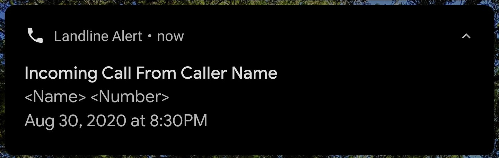

# Landline Alert Server

This is the server side of the project. Check out [Landline Alert Client](https://github.com/jessica3710/LandlineAlertClient) for
the Android client side.

Landline Alert Server is an application that sends alerts to your Android phone in real time when a landline phone rings. It'll display in a
notification:
- Name
- Number
- Date
- Time

##### Libraries/Tools Used:

- Java 11
- jSerialComm
- Firebase Cloud Messaging
- Conexant USB CX93010 ACF Modem

### How does it work?
1. Check my other repository and download the [Landline Alert Client](https://github.com/jessica3710/LandlineAlertClient) side application, here you will be able to set it 
up with your own Android device.
2. Once you download it on your Android device, you can open the app on your phone. This will give you a long length 
of characters, simply tap it and copy it.
3. Make sure you have downloaded this code, Landline Alert Server, and start with the config.properties.example.
Here you will paste your token in and if you want it on more devices, each device requires a token so download the app
on each device and paste each token in with no spaces and just a comma in between.
4. Go into the LandlineAlert class and change the serial port to the one corresponding to your fax modem. Also, change
the Firebase URL to your own Firebase project in LandlineAlertServer class. Remember to drop your 
google_application_credentials.json into the root directory of project.
5. Next run it and you are set! Since you may not want to be running this application on your computer all day, 
you can always run it on a Raspberry Pi. 
